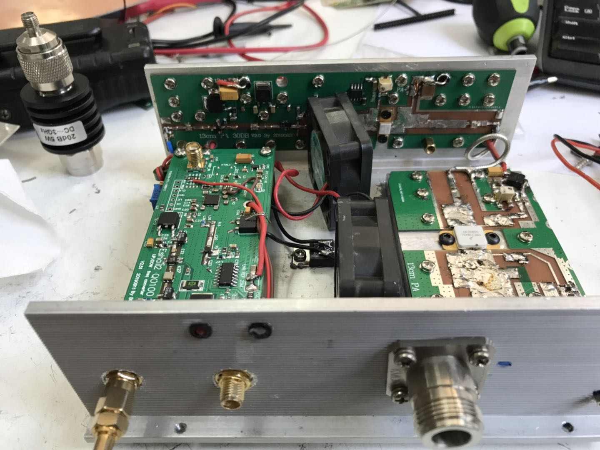

# Eshail2-QO100-Simple-Frequency-Converter
   Eshail2 QO100 简易频率转换器

## 背景资料：
BG0AUB 中国HAM，QTH:NN33   .从2019年2月开始对QO100同步卫星转发器产生兴趣，经过一些准备，在2月24日在QO100与PA3FYM完成了第一个QSO.当时使用的设备为limesdr mini+移动通讯基站改装的2.4G功放。经过半年的摸索,尝试设计制作了这个工作在QO100的上行频率转换器（集成LNB基准产生，自动检测PTT控制。只需一根馈线连接到频率变换器即可工作）实现一根馈线直连电台输出直连馈源LNB即可工作。
最初的思路来源于PE1CKK的一张框图

整体思路很简洁。ADF4351在接收状态产生51.58462Mhz信号经过2分频后得到25.79231Mhz基准信号通过双工器送到LNB内部的PLL基准输入。（例如：没有经过修改的LNB本振为9750Mhz，QO100 cw信标10489.550，如果没有任何改动那么IF=10489.550-9750=739.550，为了把IF调整到430Mhz，方便电台直接接收，需要把LNB本振调整到10489.550-430.550=10050Mhz。LNB内部使用25M晶振作为PLL基准，调整这个基准频率就可以调整PLL输出。于是就有了25.7923）这样LNB会输出稳定的430M中频信号，方便全模式电台直接接收。
    发射部分：ADF4351在发射状态产生1969.500Mhz。电台发射信号430.550Mhz，经过混频器上变频后得到1969.5+430.550=2400.05Mhz。经过滤波放大后送到馈源发射上行到卫星。

## 技术方案：
1：频率转换器:  adf4351为核心的PLL。通过ATTINY13控制，产生的RX本振经过SPF5189放到后送入74ac74二分频，经过滤波后送入LNB.当检测到PTT时，产生的TX本振经过SPF5189放大后（10DB）送入HMC213混频器，同时电台送入的430M信号经过衰减器后(13DB)送入混频器，得到2.4G的输出到SF2124滤波后经过一级SPF5189放大后，再次经过SF2124滤波后输出。最终获得约4-5db的纯净输出。(PCB集成了ATTINY13，作为RX/TX收发频率转换控制，PTT信号通过检测430Mhz信号自动获取方便使用)

2: S波段前置放大器（-5DB输入30DB输出）三级组成。输入信号经过滤波器后进入E5放大后再次滤波然后经过AH1驱动FLL357最终输出30-32DB.P1DB=30   PCB使用的廉价的FR4 0.8mm板材。

3：S波段末级放大器 （40+DB输出）。MRF21045,仍然时廉价的FR4 0.8mm板材，实际测试在30db输入时可以得到40-42db输出。P1DB=39

在一个月时间里设计安装调试了三块PCB。基本都达到了设计要求。可以很好的实现QO100的上行工作和LNB基准输出。

## 目前的问题：
1：由于电路比较简单,没有绘制SCH电路图直接绘制了PCB。所以PCB文件的标号和网络比较混乱，但是实际没有错误。ADF4351部分有电路图参考。
2：由于对频率转换部分的功耗估计不足，稳压IC工作温度比较好，需要7V输入，并良好散热，最好在pcb底部使用铜片焊接散热器
3：adf4351频率基准没有使用GPSDO,使用了可以微调的OCXO,便于微调频率误差。

目前的设计还是一个原始验证型，只是经过很短时间的测试。可能有一些未知的错误。仅供参考
在此感谢曾经热心帮助过我的朋友们,这是HAM精神的具体体现。。。

                            BG0AUB
                           20190922
20190925
重新组装了一套3块PCB。调试后性能一致。主要时为了验证可重复性。ADF4351转换器PCB换装了e5+ah1测试，25M基准输出幅度变大了达到13db。TX变化不大。
调试的难点在于FLL357与MRF21045的微带阻抗匹配，需要一点经验和技巧，特别时21045 ，装好所有器件上电几乎没有增益或者负增益，通过调整微带阻抗匹配，从-2DB调整到+11DB.这个有空了我写一个调试说明。

20190929
根据昨晚测试情况，RX回路衰减器重新调整为20db。LNB基准增加了10db衰减器。LNB基准幅度目前为-5DB。
20190930
测试了74ac74分频电路，测试发现工作不稳定，需要保持VPP 2.0v以上输入才能可靠工作。
20191014
最近工作测试整个系统工作良好。再次组装了一块变频板。调整了mmic型号。adf4351输出设置+2db。up上行lo第一级放大使用spf5189，输出10-11db到hmc213.混频后放大器使用SBB5089.经过滤波后2.4g输出在10-13db。
LNB基准adf4351设置-4db。使用SBA5089效果很好
同时整机功耗可以降低一些。发热量减少很多
20200109
测试了使用MRF21085的版本。输出功率>46dbm，前置放大器使用SBB5189+AH1+FLL357.更换了插损跟小的村田滤波器，前级增益达到了38db 后级增益13db

待续。。。。。

